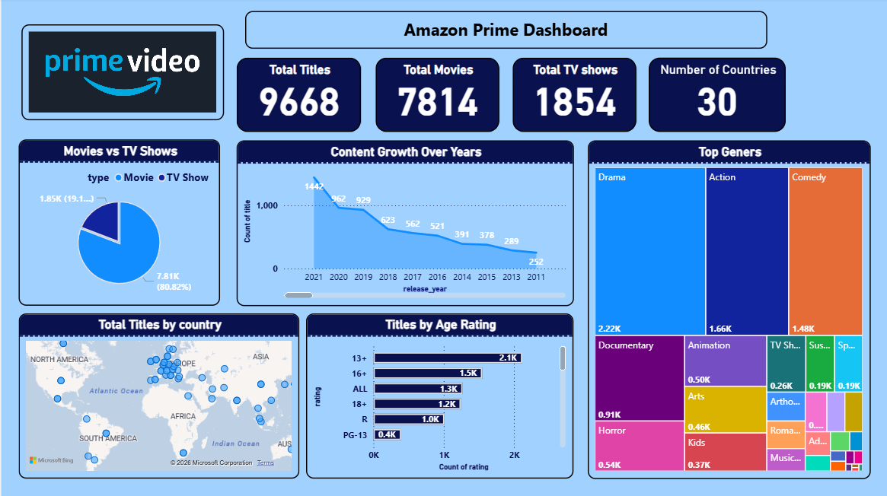

# 📺 Amazon Prime Video – Power BI Dashboard

## 📊 Project Overview

This project is an interactive Amazon Prime Video dashboard developed using Microsoft Power BI.

The dashboard analyzes titles based on content type, genres, ratings, release years, and countries.

## 🎯 Project Objectives

- Analyze Movies vs TV Shows
- Analyze content growth over the years
- Identify top genres
- Analyze titles by country
- Analyze age ratings
- Create interactive KPIs and visualizations

## 🛠️ Tools & Technologies

- Microsoft Power BI
- Power Query
- DAX
- Data Cleaning
- Data Transformation
- Data Visualization

## 📈 Dashboard Features

- Total Titles
- Total Movies
- Total TV Shows
- Number of Countries
- Movies vs TV Shows
- Content Growth Over Years
- Top Genres
- Titles by Country
- Titles by Age Rating

## 📸 Dashboard Preview

### Amazon Prime Dashboard

## 💡 Key Insights

- The dashboard contains 9,668 total titles.
- Movies account for 7,814 titles.
- TV Shows account for 1,854 titles.
- Content is distributed across 30 countries.
- Drama is one of the largest genres in the dataset.
- The dashboard provides year-wise content growth analysis.
- The age-rating analysis highlights the distribution of content across different audience categories.

## 🚀 Skills Demonstrated

- Data Cleaning
- Power Query
- DAX
- Data Modeling
- KPI Development
- Data Visualization
- Dashboard Design
- Business Intelligence

## 👨‍💻 Author

**Swapnil Ghole**

Data Analyst | Power BI | SQL | Python | Advanced Excel
